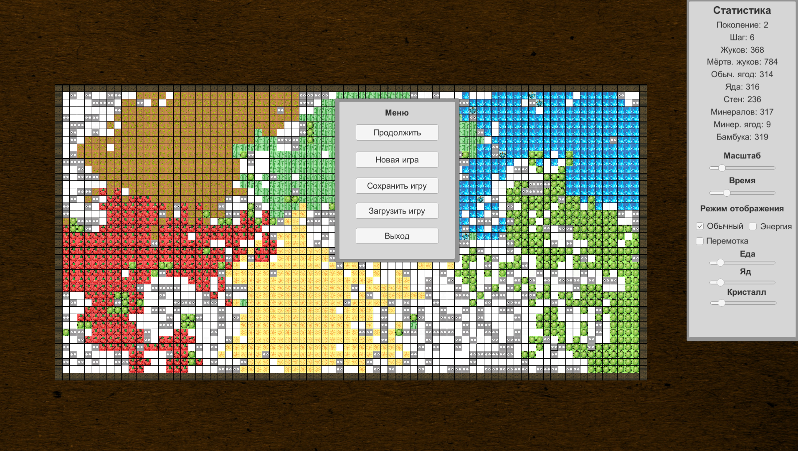

# Evolution
Репозиторий содержит проект по реализации генетического алгоритма для симуляции эволюционного процесса в специально созданной системе

## Описание

### Игровой экран и меню:

На главном экране отображается эволюционный процесс, происходящий в смоделированном мире. Перемещающиеся клетки, оставляющие за собой цветовой шлейф - это жуки. В каждом жуке записан геном, (случайный последовательность определенных команд) с помощью которого реализовано его поведение. Цвет жука определяется источником пищи. Так, синий цвет - кристаллы, зеленый - ягоды и т.п. Жуки перемещаются по карте, размножаются и взаимодействуют с окружающей средой, постепенно все лучше и лучше приспосабливаясь к сгенерированному миру и увеличивая продолжительность жизни и количество особей. Демонстрацию этого процесса, вы можете посмотреть [тут](examples/demonstration.gif)

## Авторы

* **Максим Шипицин** - *Разработка проекта и требований* - [ IngeniariusSoftware](https://github.com/IngeniariusSoftware)

* **Кирилл Грищук** - *Разработка проекта и требований* - [ Kirya522](https://github.com/kirya522)

## License

This project is licensed under the AGPL-3.0 License - see the LICENSE.md file for details

## Спасибо
- Каналу [foo52ru](https://www.youtube.com/user/foo52ru) за демонстрацию возмонжностей применения генетических алгоритвом и создание
эволюционной модели с их использованием
