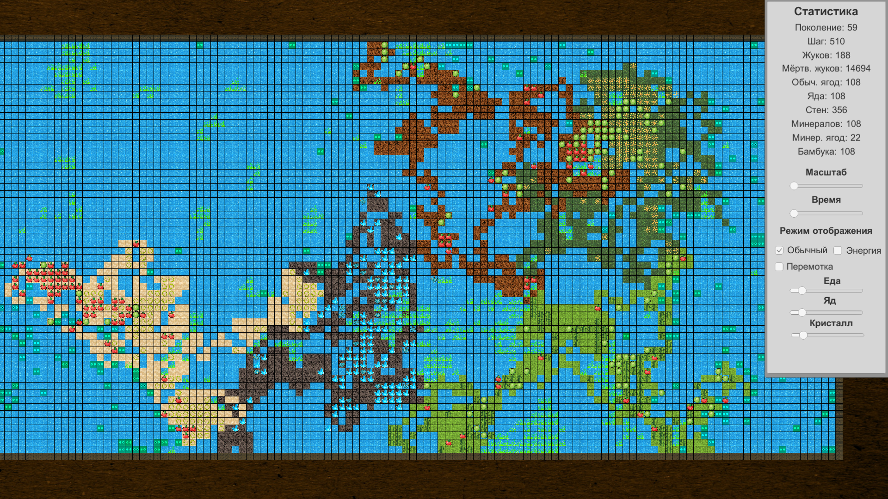

# Evolution
Репозиторий содержит проект по реализации генетического алгоритма для симуляции эволюционного процесса в специально созданной среде

## Описание

### Игровой экран и меню:

  На главном экране отображается эволюционный процесс, происходящий в смоделированном мире. Перемещающиеся клетки, оставляющие за собой цветовой шлейф - это жуки. В каждом жуке записан геном, (случайный последовательность определенных команд) с помощью которого реализовано его поведение. Цвет жука определяется источником пищи. Так, синий цвет - кристаллы, зеленый - ягоды и т.п. Жуки перемещаются по карте, размножаются и взаимодействуют с окружающей средой, постепенно все лучше и лучше приспосабливаясь к сгенерированному миру и увеличивая продолжительность жизни и количество особей. Демонстрацию этого процесса, вы можете посмотреть [тут](examples/demonstration.gif).

### Mystery Biomes

  Ого! У нас вышло целое масштабное обновление под названием "Mystery Biomes". Оно добавляет генерацию различных типов биомов, в которых затем уже появляются различные сущности. Так, например, бамбук может вырасти только в биоме с джунглями (текстура светло-зеленых зарослей). Такая же ситуация со всеми остальными сущностями, из-за чего на карте появлются необычные материки с характерной для них флорой. Также было добавлено море как некий аналог пустой клетки, однако, для передвижения по суше и по воде используются разные команды. Еще были добавлены водоросли. Это обычная съедобная сущность, которая сытнее всех остальных аналогов, однако, встречается только в море. А вот [тут](https://yadi.sk/i/0F6EZsR3qM00Eg) можно посмотреть трейлер этого обновления.

## Авторы

* **Максим Шипицин** - *Разработка проекта и требований* - [ IngeniariusSoftware](https://github.com/IngeniariusSoftware)

* **Кирилл Грищук** - *Разработка проекта и требований* - [ Kirya522](https://github.com/kirya522)

## License

This project is licensed under the AGPL-3.0 License - see the [LICENSE.md](LICENSE.md) file for details

## Спасибо
- Каналу [foo52ru](https://www.youtube.com/user/foo52ru) за демонстрацию возможностей применения генетических алгоритмов и создание
эволюционной модели с их использованием
